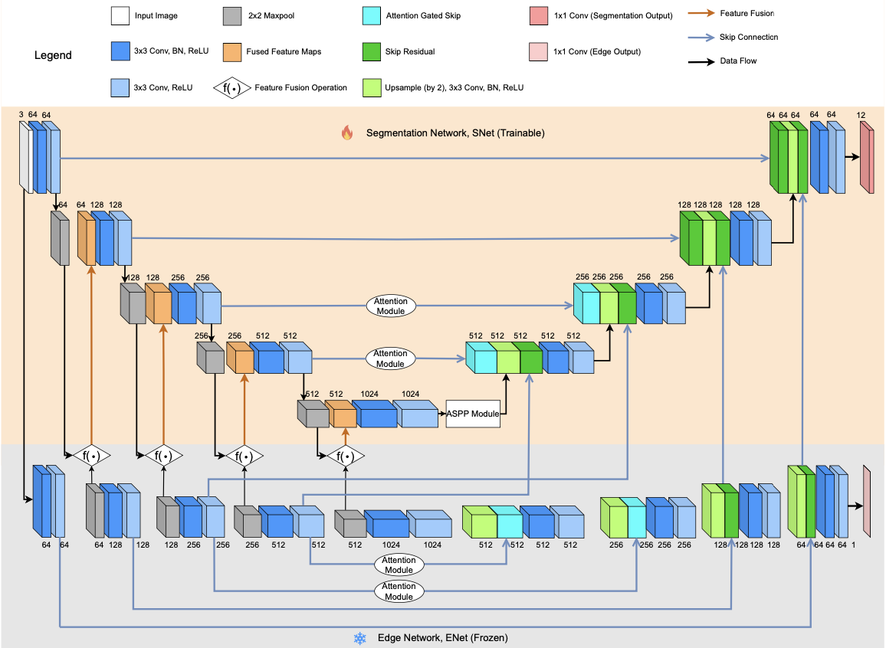

# ECASeg 
- Official Repository for the paper [ECASeg: Enhancing Semantic Segmentation with Edge Context and Attention Strategy](https://www.sciencedirect.com/science/article/pii/S1877050925009469)
  

**Overall Model Architecture**
---


**Feature Fusion Overview**
---
 

**Experimental Results**
---
###Comparison of ECASeg against contemporary models
Table: Quantitative analysis summary  
*The % change is calculated w.r.t. test mIoU between the proposed model and the respective model in comparison.*

| **Model**     | **U-Net Baseline** | **U-Net Att** | **SegNet** | **FCN** | **LargeFOV** | **Cyclic Net** | **GSAUNet** | **ECASeg (this work)** |
|--------------|--------------------|---------------|------------|--------|--------------|----------------|-------------|-------------------------|
| **Acc (%)**   | 90.82              | 91.21         | 84.00      | 83.90  | 85.95        | 91.38          | 91.44       | **91.86**               |
| **mIoU (%)**  | 63.29              | 64.55         | 46.30      | 45.00  | 50.18        | 62.98          | 65.47       | **66.53**               |
| **% Change**  | +5.12              | +3.07         | +43.69     | +47.84 | +32.58       | +5.64          | +1.62       | -                       |

**Environment**
---
```bash
torch==2.1.2
torchvision==0.16.2
python==3.10
```
